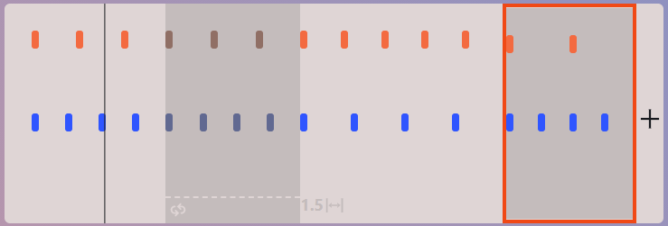
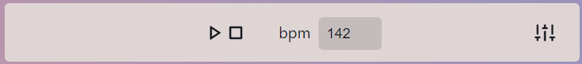
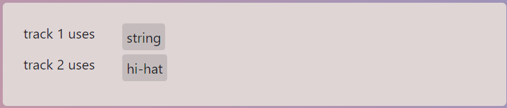

[](https://hits.seeyoufarm.com)
[](https://opensource.org/licenses/MIT)

## Polyrhythm 3
> This is an alpha of the new release of polyrhythm metronome, it is in the test phase right now but will soon replace the current polyrhythm. 


## Tutorial

### Visualization block


The UI is divided into blocks, the first block is the visualization block, here you can see your "sections" displayed in a midi-esque fashion.
It allows you to do the following actions:
- add new sections with the add button to the right 
- select the section that you are currently editing in the editor by clicking on it.
- swap two sections by dragging one section over another.

### Control block


Next block under the visualization block is the transport control block. It allows you to change the bpm as well as to pause, play and stop.
You can also see a button that opens [additional settings](#instrument-block), we will get to it later.

### Editor block


The last visible block is the editor block, it allows you to edit the [section's parameters](#section-properties) like the ratios of the polyrythms etc. The properties are mostly the same as the previous polyrhythm versions however some new features like the offsets and swing were added.

### Instrument block


This block allows you to select the instrument for a specific track. You can open this block by using the most right button in the control block.

### Top right buttons


These buttons are respectively:
- share button
- export as MIDI file button
- change light/dark mode

### Section properties

* RATIOS: this is your musical ratio like 3:4 polyrhythm for example, you're not limited in any way here.
    - For example 3:5 is a polyrhythm where in the duration of one bar you get 3 beats and 5 beats simultaneously.
* SUBDIVIDES: this lets you subdivide every beat into n non-accentuated beats.
* OFFSETS: this lets you offset every beat by some value. 0 means no offset and 1 means an offset of the length of one beat which is the maximum offset i.e the maximum offset is the `(bar length) / (beat ratio)` 
* SCALE: this is basically a mutliplier on the bar length.
For example 2 would mean that the current section has a length of 2 bars. Fractions are allowed...
* REPEAT: how many times to repeat the section
* SWING: swing amount
    - 0 : none
    - 1 : max swing
* REMOVE: this button deletes the selected section.

> for additional information refer to polyrhythm2 wiki

## Running the project locally

```
git clone <this repo>
cd polyrhythm3
npm install
npm run dev
```
then open localhost:3000 in your browser...

> for more information refer to Next.js documentation.
